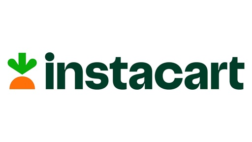

# Instacart Basket Analysis

You’re an analyst for an existing company, Instacart, an online grocery store
that operates through an app.

## About

Instacart already has very good sales, but they want to uncover more information about their sales patterns. 

## Goals

- **Goal 1** – Perform an initial data and exploratory analysis of some of their data in order to derive insights and suggest strategies based on a number of key questions from the sales and marketing teams, including identifying the busiest days and hours for orders, understanding spending patterns, and exploring product popularity by department.
- **Goal 2** – Create a report that describes your analysis methodology, your results, and your
recommendations for Instacart stakeholders

## Source

Citation: “The Instacart Online Grocery Shopping Dataset 2017”, Accessed from www.instacart.com/datasets/grocery-shopping-2017 via Kaggle on 10/16/24.

## Code Overview

Code was written in Python and executed in Jupyter notebooks. Utilizes the following libraries:

Pandas: For data manipulation and analysis

NumPy: For numerical operations and array handling

OS: For interacting with the operating system, including file and directory operations

Matplotlib.pyplot: For creating static, interactive, and animated visualizations

Matplotlib.ticker.FuncFormatter: For custom formatting of axis ticks in plots

Seaborn: For statistical data visualization and creating informative, attractive graphics

Scipy: For scientific and technical computing, including advanced mathematical functions

## Disclaimer

Instacart is a real company that’s made their data available online, however customer data is fictitious and used for the purposes of Career Foundry's Data Analytics program.

## Contact

For any questions, please contact [Gizem Kilic](mailto:gk.gizemkilic@gmail.com).
